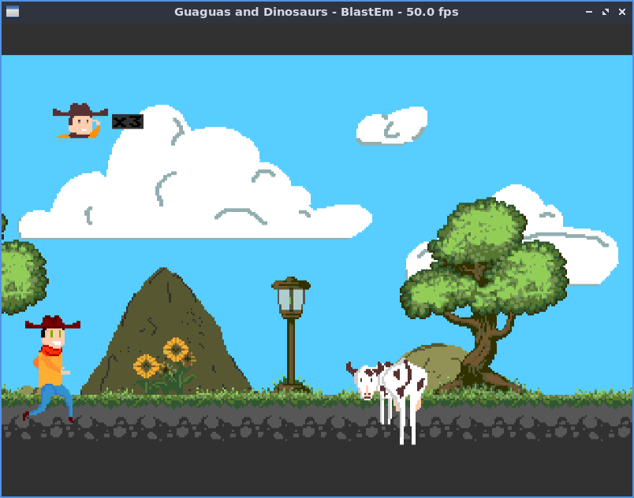

# Guaguas And Dinosaurs

Este juego para Sega Mega Drive, ha sido desarrollado dentro de la jam today online celebrada los dias 19,20 y 21 de Noviembre de 2021. 

El objetivo del juego, es que nuestro personaje llamado Jota, llegue a por su contrato de teletrabajo; para ello, debe sortear una serie de obstaculos, saltando o pasando bajo ellos.

# Controles

Los controles de este juego son sencillos:

Boton A,B o C: salto.

Boton abajo: Agacharse.

Este juego ha sido desarrollado en conjunto con las siguientes personas.

* Alejandro Cayuela Ramirez: Graficos.
* Diego Escudero Martin: Musica.
* Francisco Javier Valero: Programacion.
* Emilio Lopez Berenguer: Programacion.
* Victor Suarez Garcia: Programacion.

Este juego ha sido desarrollado usando el kit de desarrollo [SGDK](https://github.com/Stephane-D/SGDK), y la extension para Visual Studio Code: [genesis Code](https://marketplace.visualstudio.com/items?itemName=zerasul.genesis-code).